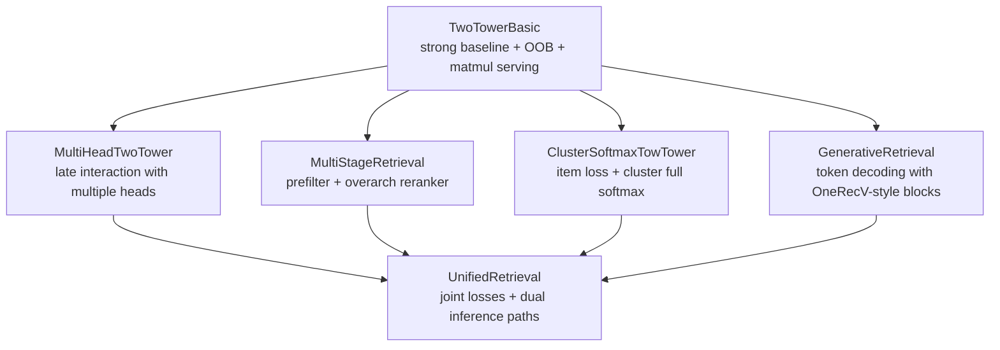

# A Unified Retrieval Argument

## Core Claim
This repository argues that generative retrieval and two-tower retrieval should not be treated as separate, competing systems.

Instead, we can train them together in one model family, reuse the same user/item representations, and choose the inference path based on product constraints:
- Fast embedding retrieval with matrix multiplication (tower path)
- Autoregressive semantic-ID generation (generative path)

If this is done correctly, the unified system should be at least as good as current two-tower state of the art for retrieval quality and latency-sensitive serving, while also unlocking generative retrieval behaviors without requiring a separate model stack.

## Step 1: Build a Strong Two-Tower Baseline (`TwoTowerBasic`)
We start from the known strong baseline and make it educational:
- User encoder combines sequence history and lightweight static features.
- Item encoder produces item embeddings for dot-product retrieval.
- OOB negative sampler (mixed-negative style) increases training signal beyond in-batch negatives.
- Inference uses a cached GPU item embedding table and direct matmul for top-k retrieval.

Why this step matters:
- This baseline already reflects how production two-tower systems are commonly trained and served.
- It gives us a stable anchor to compare all later variants.

## Step 2: Add Late Interaction (`MultiHeadTwoTower`)
Next we add a ColBERT-style variant with minimal change:
- Replace single user embedding with multiple user heads.
- Keep item encoding and negative-sampling workflow familiar.
- Aggregate head-wise similarities (max/logsumexp).

Why this step matters:
- It shows richer interaction can be layered on top of the same two-tower foundation.
- It keeps compatibility with the same data and training loop style.

## Step 3: Add Two-Stage Retrieval (`MultiStageRetrieval`)
Now we extend to a prefilter + overarch setup:
- Stage 1 prefilter: fast KNN-style matmul over cached embeddings.
- Stage 2 overarch: combine prefilter score with `u_u_dots` and `u_i_dots` in an MLP.
- Train with impression-style pointwise objectives.

Why this step matters:
- It preserves serving efficiency while improving ranking expressiveness.
- It demonstrates that multi-stage retrieval is still compatible with the same base architecture.

## Step 4: Add Cluster Supervision (`ClusterSoftmaxTowTower`)
We then add a full-softmax cluster objective on item-side cluster IDs:
- Keep sampled-softmax item objective.
- Add full-softmax cluster loss (hashed large cluster vocabulary).
- Jointly optimize both.

Why this step matters:
- Cluster targets are often easier to learn early.
- Full-softmax cluster supervision quickly corrects coarse semantic mistakes.
- This improves learning dynamics without discarding two-tower strengths.

## Step 5: Add Generative Retrieval (`GenerativeRetrieval`)
Now we add semantic-ID generation with teacher forcing:
- User side stays intentionally light (history tokens + static tokens concatenated on token axis).
- Decoder follows OneRecV-style block ordering:
  1. cross-attention to user tokens
  2. self-attention on generated tokens
  3. MoE-FFN
- Target is semantic token sequence (for example length 4 with BOS).

Why this step matters:
- It captures TIGER-like generative retrieval behavior.
- It does not require abandoning the existing two-tower ecosystem.

## Step 6: Close the Loop with Joint Training (`UnifiedRetrieval`)
Finally, we combine both objectives in one model:
- Tower sampled-softmax loss
- Generative semantic-token loss
- Weighted sum during training

At inference, we expose two callable paths from the same trained model:
- `retrieve_with_tower(...)` for fast ANN/matmul style retrieval
- `generate_semantic_ids(...)` for generative retrieval

Why this is the critical result:
- We are no longer forced into an either/or choice between discriminative and generative retrieval.
- We can keep the proven two-tower serving path and quality, while adding generative capability as a first-class option.

## Why This Is Convincing
The argument is not just conceptual; it is architectural and operational:
- Architectural: every major two-tower variant (basic, multi-head, cluster-aware, multi-stage) remains compatible with the unified design.
- Training: one model can optimize both retrieval paradigms simultaneously.
- Serving: one model can run both inference styles in parallel or selectively, depending on latency and product needs.

Practical consequence:
- Unified retrieval is a strict superset strategy: retain what makes current two-tower SOTA strong, then add generative behavior without isolating it into a separate model program.

## Evolution Diagram

