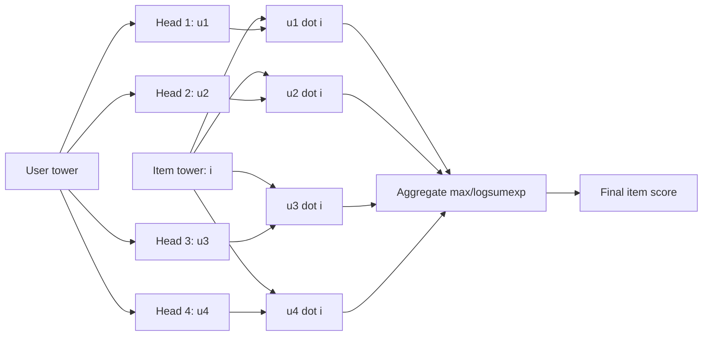
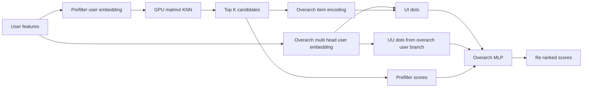
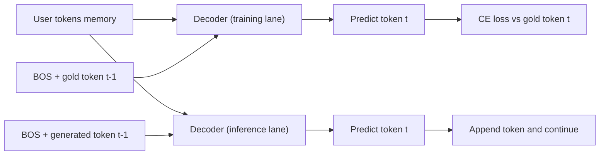
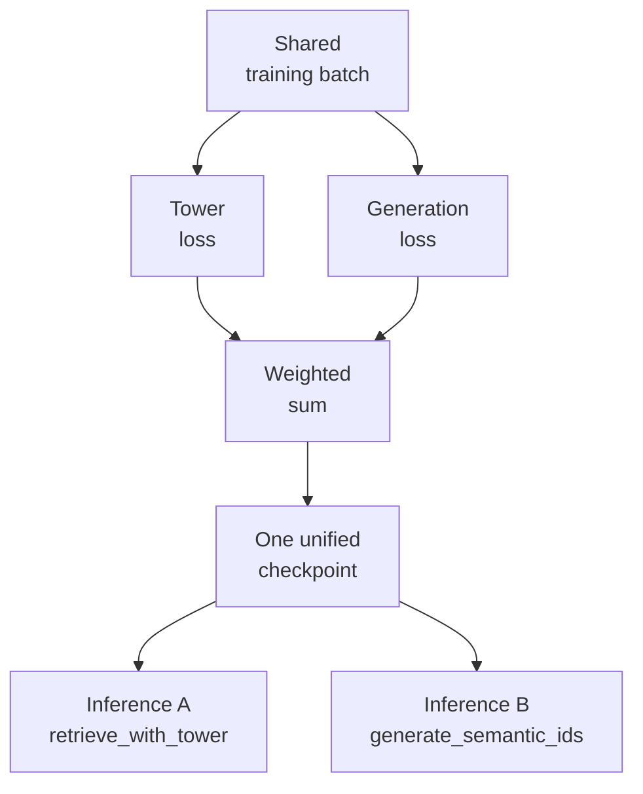
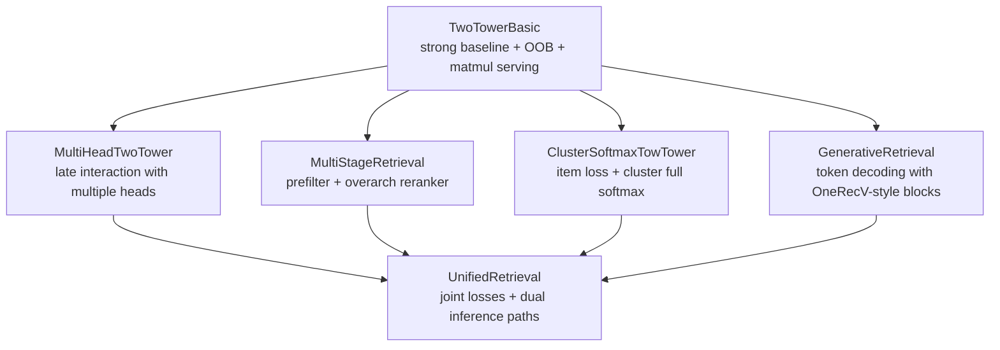

# Unified Retrieval (over item id and semantic id)

## Core Claim

This repository argues that generative retrieval and two-tower retrieval should not be treated as separate, competing systems.

Instead, we can train them together in one model family, reuse the same user/item representations, and choose the inference path based on product constraints:

- Fast embedding retrieval with matrix multiplication (tower path)
- Autoregressive semantic-ID generation (generative path)

If this is done correctly, the unified system should be at least as good as current two-tower state of the art for retrieval quality and latency-sensitive serving, while also unlocking generative retrieval behaviors without requiring a separate model stack.

## Step 1: Build a Strong Two-Tower Baseline (`TwoTowerBasic`)

We start from the known strong baseline and make it educational:

- User encoder combines sequence history and lightweight static features.
- Item encoder produces item embeddings for dot-product retrieval.
- OOB negative sampler (mixed-negative style) increases training signal beyond in-batch negatives.
- Inference uses a cached GPU item embedding table and direct matmul for top-k retrieval.

Why this step matters:

- This baseline already reflects how production two-tower systems are commonly trained and served.
- It gives us a stable anchor to compare all later variants.

## Step 2: Add Late Interaction (`MultiHeadTwoTower`)

Next we add a [ColBERT](https://arxiv.org/abs/2004.12832)-style variant with minimal change:

- Replace single user embedding with multiple user heads.
- Keep item encoding and negative-sampling workflow familiar.
- Aggregate head-wise similarities (max/logsumexp).

Why this step matters:

- It is a route to multi-interest or multi-objective modeling.
- It shows richer interaction can be layered on top of the same two-tower foundation.
- It keeps compatibility with the same data and training loop style.

## Step 3: Add Two-Stage Retrieval (`MultiStageRetrieval`)

Now we extend to a prefilter + overarch setup:

- Stage 1 prefilter: fast KNN-style matmul over cached embeddings.
- Stage 2 overarch: produce a separate overarch user representation (`[B, H, D]`) and
  compute `u_u_dots` and `u_i_dots` from that overarch branch; combine these with
  stage-1 prefilter scores in an MLP.
- Train with impression-style pointwise objectives.
- Reference: [Revisiting Neural Retrieval on Accelerators](https://arxiv.org/abs/2306.04039).

Why this step matters:

- It preserves serving efficiency while improving accruacy since final set is also trained for accuracy not just recall.
- It demonstrates that multi-stage retrieval is still compatible with the same base architecture.

## Step 4: Add Cluster Supervision (`ClusterSoftmaxTowTower`)

We then add a full-softmax cluster objective on item-side cluster IDs:

- Keep sampled-softmax item objective.
- Add full-softmax cluster loss (hashed large cluster vocabulary).
- Jointly optimize both.

Why this step matters:

- Cluster targets are often easier to learn early.
- Full-softmax cluster supervision quickly corrects coarse semantic mistakes.
- This improves learning dynamics without discarding two-tower strengths.
- As mentioned in [Efficient Item IG based generative retrieval](https://arxiv.org/pdf/2509.03746v1) this is a viable route to generative retrieval while not exposing one to the lossy compression of semantic ids.

## Step 5: Add Generative Retrieval (`GenerativeRetrieval`)

Now we add semantic-ID generation with teacher forcing:

- User side stays intentionally light (history tokens + static tokens concatenated on token axis).
- Like [OneRec](https://arxiv.org/abs/2506.13695) we can build both a static pathway and then history token pathway for [B, 1+L, D] output since we don't need to limit ourselves to compressing all user knowledge into [B, D]
- Decoder follows [OneRecV2](https://arxiv.org/abs/2508.20900)-style block ordering:
  1. cross-attention to user tokens
  2. self-attention on generated tokens
  3. MoE-FFN
- Target is semantic token sequence (for example length 4 with BOS).

Why this step matters:

- It adds a new end-to-end generative inference path for item prediction, not just
  KNN + overarch-style inference.
- It does not require abandoning the existing two-tower ecosystem.
- Note that the first token prediction is essentially still a two-tower setup. BOS token prpduces a summary by cross attention and then dot product with vocab token to produce probabilities. **It is in decoding future tokens that generative retrieval differentiates itself.**

## Step 6: Close the Loop with Joint Training (`UnifiedRetrieval`)

Finally, we combine both objectives in one model:

- Sampled-softmax loss for prefilter (single or multi-head) and potionally overarch loss.
- Generative semantic-token full softmax loss
- Weighted sum of losses during training

At inference, we expose two callable paths from the same trained model:

- `retrieve_with_tower(...)` for fast ANN/matmul style retrieval
- `generate_semantic_ids(...)` for generative retrieval

Why this is the critical result:

- We are no longer forced into an either/or choice between item id and semantic id based retrieval.
- The user info processing is done with both losses making it better than each individually.
- Decoding is what is incremental to "generative retrieval" and we are able to leverage that.

## Why This Makes Sense In Practice

If you are already running a strong two-tower stack, this approach is a low-risk extension, not a rewrite.

Why the logic is sound:

- You keep the proven two-tower objective and serving path.
- You add a second objective (semantic generation) on top of the same user/item training examples.
- You get one checkpoint that supports two inference modes, so you can pick by latency/product need.

Why this should be convincing to a skeptical reader:

- It is additive: no need to throw away existing two-tower infrastructure.
- It is testable: you can compare tower-only, generative-only, and joint training from the same data backbone.
- It is operationally flexible: KNN/fast matmul retrieval remains available even after adding generation.

## What You Need To Try This

Minimum data requirements:

- The same interaction/impression logs you already use for two-tower training.
- Item-side features used by your current tower model.
- A semantic id sequence per item (for example 4 tokens with BOS), logged or precomputed and joined by item id.

Minimum training setup:

- Keep your current two-tower loss.
- Add teacher-forcing semantic-token loss.
- Train jointly with configurable loss weights.
- Track both retrieval metrics (for tower path) and token/generative metrics (for generation path).

Minimum serving setup:

- Keep the existing GPU index + matmul path (`retrieve_with_tower`).
- Add semantic autoregressive decoding path (`generate_semantic_ids`).
- Route traffic by use case, or run both in parallel for evaluation.

Bottom line:

- Unified retrieval is a practical superset strategy: at least preserve current two-tower strength, while gaining a production-ready path to end-to-end generative retrieval.

## Evaluation: Compare Routes with Bulk Recall

To make this convincing in your own stack, evaluate all routes on the same held-out set.

Routes to evaluate:

- Two-tower retrieval route (`retrieve_with_tower`).
- Generative route (`generate_semantic_ids`) mapped back to items via semantic-id lookup.
- Optional hybrid route (union/rerank of tower and generative candidates).

Recommended bulk evaluation protocol:

- Use the same user query batch and same ground-truth positives for all routes.
- Run offline bulk inference to avoid online noise and latency jitter.
- Compute Recall@K for multiple K values (for example 10, 50, 100, 500).
- Also track coverage (how many distinct positives each route can surface) and latency.

Why this is important:

- Tower route usually gives strong stable recall and excellent latency.
- Generative route can recover different candidates and improve long-tail/semantic coverage.
- Hybrid routing can outperform either alone by combining complementary candidate sets.

A simple success criterion:

- Jointly trained unified model should match or beat tower-only recall at practical K,
  while adding a second inference path that contributes incremental positives.

## Evolution Diagram

